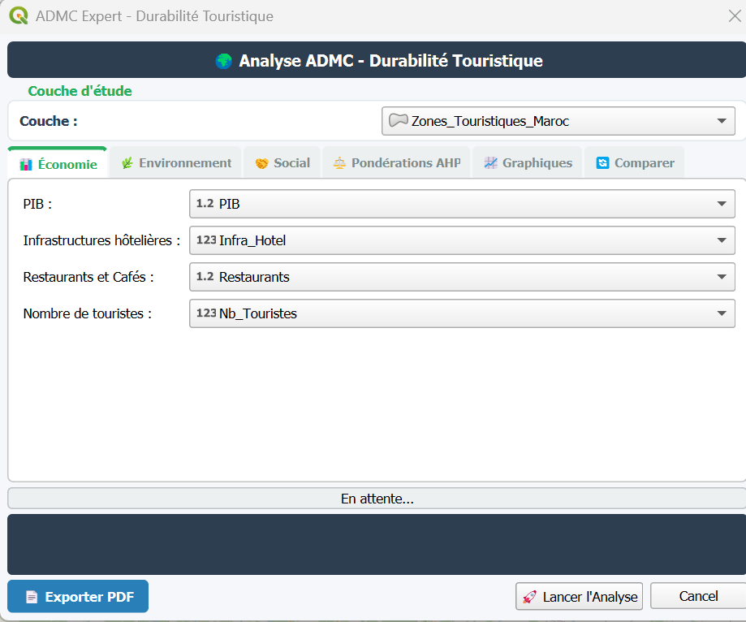
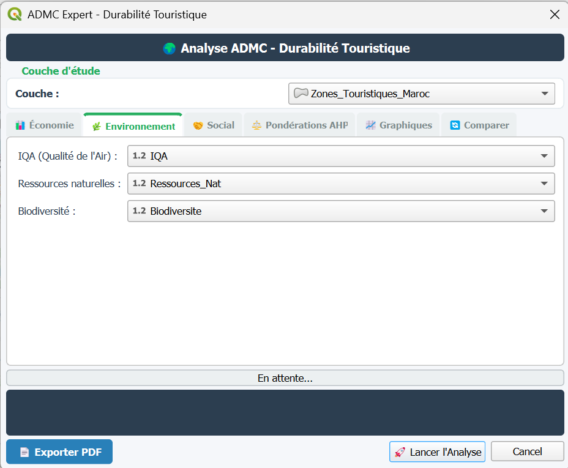
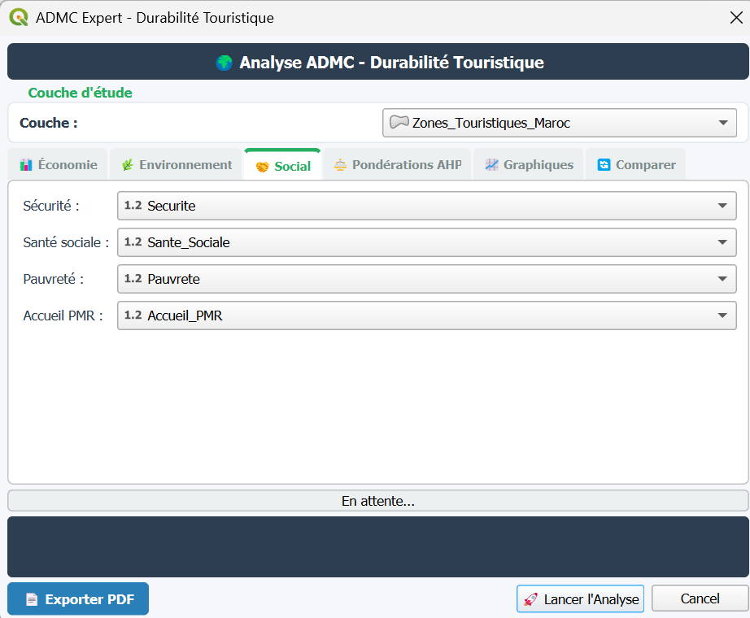
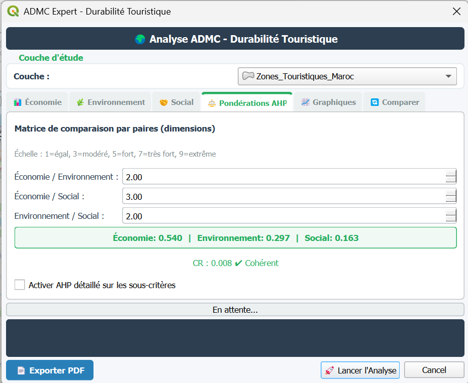
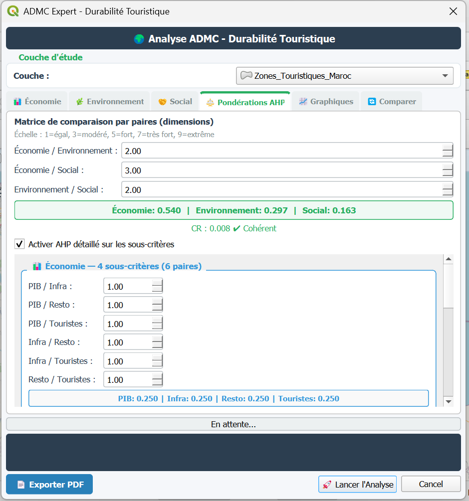
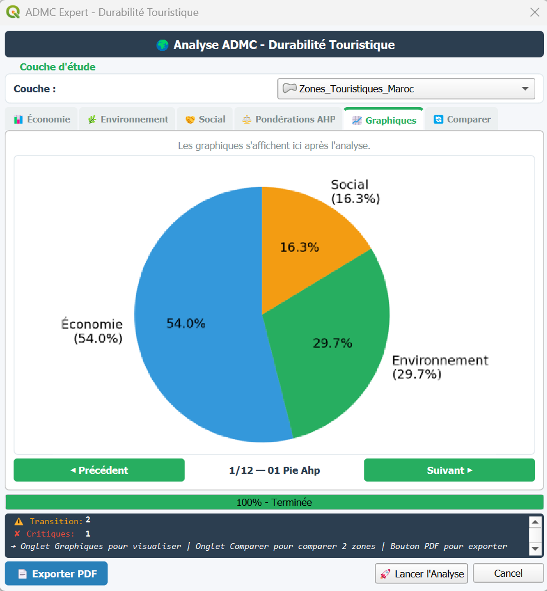
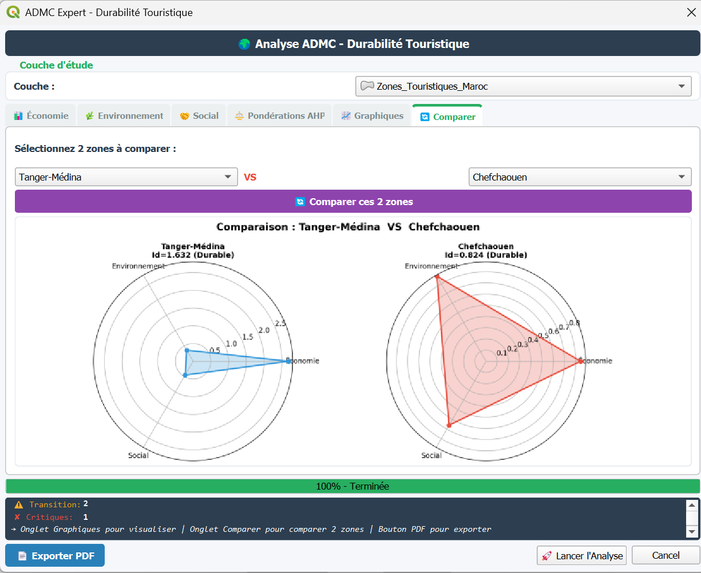
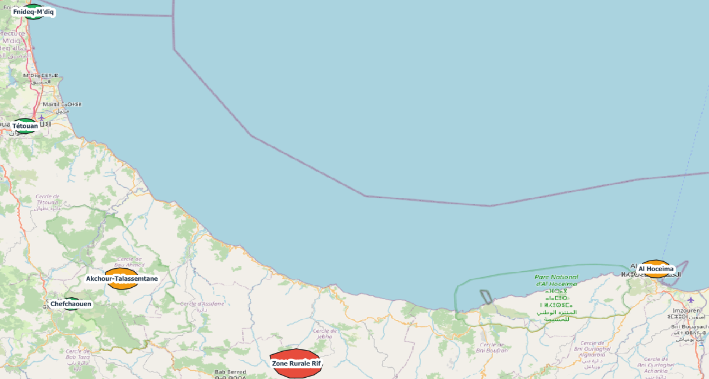
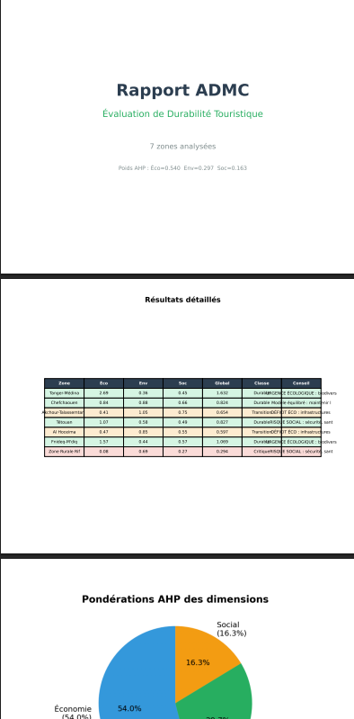

# 🌍 SustainableZone — QGIS Plugin

**Analyse Multi-Critère de Durabilité Touristique (ADMC)**  
A QGIS plugin that scores and maps tourist zones across three sustainability dimensions — Economy, Environment, and Social — using AHP (Analytic Hierarchy Process) weighting.

---

## 📋 Table of Contents

- [Overview](#overview)
- [Features](#features)
- [Screenshots](#screenshots)
- [Requirements](#requirements)
- [Installation](#installation)
- [Usage](#usage)
- [AHP Methodology](#ahp-methodology)
- [Criteria Reference](#criteria-reference)
- [Output](#output)
- [File Structure](#file-structure)
- [License](#license)

---

## Overview

**SustainableZone** evaluates tourist zones using a weighted multi-criteria decision analysis. It takes a vector layer as input, reads indicator fields (GDP, air quality, safety, etc.), computes normalized scores for each dimension, and generates a composite sustainability index per zone. Results are visualized directly on the QGIS map using a graduated color renderer, and can be exported as a PDF report.

The plugin implements the **AHP (Analytic Hierarchy Process)** method at two levels:
- **Dimension level** — relative weight of Economy, Environment, and Social
- **Sub-criterion level** *(optional)* — fine-grained pairwise comparison within each dimension

---

## Features

- ✅ Auto-detection of indicator fields from layer attribute names
- ✅ AHP pairwise comparison matrix for the 3 main dimensions
- ✅ Optional detailed AHP for all 11 sub-criteria (3 groups × 4/3/4)
- ✅ Consistency Ratio (CR) validation with visual feedback
- ✅ Graduated choropleth map rendering on the active layer
- ✅ Interactive chart viewer (navigable with Prev / Next buttons)
- ✅ Side-by-side zone comparison tool
- ✅ PDF export of full analysis report
- ✅ Real-time console log inside the dialog

---

## Screenshots

> **Note:** Replace the placeholder images below with actual screenshots from your QGIS environment. Save them in a `screenshots/` folder at the root of the repository.

### Main Dialog — Layer Selection

The plugin dialog opens after clicking **Calculer ADMC** in the toolbar. Select your vector layer and the field combo boxes will auto-populate.


---

### Tab: Economy Indicators

Map your economic fields (GDP, hotel infrastructure, restaurants, tourist count) to the layer attributes.



---

### Tab: Environment Indicators

Map environmental fields: Air Quality Index (IQA), natural resources, and biodiversity.



---

### Tab: Social Indicators

Map social indicators: security, social health, poverty, and PMR accessibility.



---

### Tab: AHP Weights

Adjust the pairwise comparison ratios for the three dimensions. The plugin computes the resulting weights and displays the Consistency Ratio (CR) in real time.



> A CR < 0.10 is shown in green (✔ Cohérent). A CR ≥ 0.10 is shown in red (✘ Incohérent) and indicates the comparison matrix should be revised.

---

### Optional: Detailed Sub-Criteria AHP

Enable the checkbox **"Activer AHP détaillé sur les sous-critères"** to reveal pairwise spinboxes for each of the 11 sub-criteria, grouped by dimension.



---

### Tab: Charts

After running the analysis, charts are displayed here with navigation controls.



---

### Tab: Zone Comparison

Select any two zones from the dropdowns and click **Comparer** to get a side-by-side comparison of their scores.



---

### Map Result — Choropleth Layer

The analyzed layer is rendered using a graduated green color scheme based on the composite sustainability score (0–100).



---

### PDF Export

Click **📄 Exporter PDF** to save a full analysis report.



---

## Requirements

| Dependency | Version |
|------------|---------|
| QGIS | ≥ 3.x |
| Python | ≥ 3.6 |
| NumPy | Any recent version |
| PyQt5 | Bundled with QGIS |

NumPy is typically included with the QGIS Python environment. No external installation is required beyond QGIS itself.

---

## Installation

### Option A — Install from ZIP (Recommended)

1. Download the latest release ZIP from the [Releases](../../releases) page.
2. In QGIS, go to **Plugins → Manage and Install Plugins → Install from ZIP**.
3. Select the downloaded ZIP file and click **Install Plugin**.
4. Enable **SustainableZone** in the plugin list.

### Option B — Manual Installation

1. Clone or download this repository.
2. Copy the `sustainablezone/` folder to your QGIS plugins directory:

```
# Windows
%APPDATA%\QGIS\QGIS3\profiles\default\python\plugins\

# Linux / macOS
~/.local/share/QGIS/QGIS3/profiles/default/python/plugins/
```

3. If `resources.py` is missing, compile it:

```bash
pyrcc5 -o resources.py resources.qrc
```

4. Restart QGIS and enable the plugin via **Plugins → Manage and Install Plugins**.

---

## Usage

1. Load a **vector layer** in QGIS with at least some of the supported indicator fields (see [Criteria Reference](#criteria-reference) below).
2. Click the **SustainableZone** toolbar button or go to **Plugins → SustainableZone → Calculer ADMC**.
3. In the dialog, confirm the correct layer is selected — fields will auto-map by keyword matching.
4. Review and adjust field mappings on the **Economy**, **Environment**, and **Social** tabs.
5. Go to the **AHP Weights** tab and set your pairwise comparison ratios. Watch the CR indicator to ensure coherence.
6. Optionally enable **Detailed Sub-Criteria AHP** for finer control.
7. Click **🚀 Lancer l'Analyse**.
8. Review results in the **Charts** and **Compare** tabs, and on the QGIS map.
9. Export a report with **📄 Exporter PDF**.

---

## AHP Methodology

The plugin uses the **Analytic Hierarchy Process (AHP)** developed by Thomas L. Saaty. For each pair of criteria, the user enters a ratio value between 0.11 and 9.0 representing relative importance.

The plugin builds the pairwise comparison matrix, computes weights via the **geometric mean method**, and validates coherence using the **Consistency Ratio (CR)**:

```
CR = CI / RI
CI = (λmax − n) / (n − 1)
```

Where `RI` is the Random Index for a matrix of size `n`:

| n | 1 | 2 | 3 | 4 | 5 | 6 | 7 | 8 | 9 | 10 |
|---|---|---|---|---|---|---|---|---|---|----|
| RI | 0.00 | 0.00 | 0.58 | 0.90 | 1.12 | 1.24 | 1.32 | 1.41 | 1.45 | 1.49 |

A CR below **0.10** is considered acceptable.

---

## Criteria Reference

The plugin expects fields in your vector layer whose names contain one of the following **keywords** (case-insensitive):

### 📊 Economy (4 sub-criteria)
| Sub-criterion | Normalization | Keywords to match |
|---------------|:--------------|-------------------|
| PIB (GDP) | 500 | `pib`, `gdp`, `chiffre`, `affaire`, `revenu` |
| Hotel Infrastructure | 400 | `infra`, `hotel`, `hebergement` |
| Restaurants & Cafés | 700 | `resto`, `restaurant`, `cafe`, `terroir`, `artisan` |
| Tourist Count | 1000 | `tourist`, `visiteur` |

### 🌿 Environment (3 sub-criteria)
| Sub-criterion | Normalization | Keywords to match |
|---------------|:--------------|-------------------|
| IQA (Air Quality) | 40 | `iqa`, `air`, `climat`, `meteo`, `qualit` |
| Natural Resources | 600 | `ressource`, `nature`, `eau` |
| Biodiversity | 900 | `bio`, `diversite`, `faune` |

### 🤝 Social (4 sub-criteria)
| Sub-criterion | Normalization | Keywords to match |
|---------------|:--------------|-------------------|
| Security | 68 | `secu`, `police`, `crime` |
| Social Health | 60 | `sante`, `social`, `tradition` |
| Poverty *(inverted)* | 50 | `pauvre`, `chomage`, `emploi` |
| PMR Accessibility | 50 | `pmr`, `mobilite`, `accueil`, `handicap` |

> **Inverted criterion:** Poverty is treated as an inverse indicator — a lower raw value produces a higher score.

---

## Output

After running the analysis, the plugin:

- Adds a **`score_eco`**, **`score_env`**, **`score_soc`**, and **`score_global`** field to the layer (or updates them if they exist).
- Applies a **graduated green choropleth renderer** to the layer based on `score_global`.
- Generates **charts** (bar charts, radar charts, etc.) saved as PNG files in the system temp folder.
- Populates the **Comparison** tab with all analyzed zones.

---

## File Structure

```
sustainablezone/
├── SustainableZone.py              # Main plugin class (logic, scoring, rendering)
├── SustainableZone_dialog.py       # Dialog class (UI logic, AHP spinboxes, chart navigation)
├── SustainableZone_dialog_base.ui  # Qt Designer UI file
├── __init__.py                     # Plugin entry point
├── metadata.txt                    # QGIS plugin metadata
├── icon.png                        # Toolbar icon
├── resources.qrc                   # Qt resources file
├── resources.py                    # Compiled resources (generate with pyrcc5)
└── README.md                       # This file
```

---

## License

This plugin was generated using the **QGIS Plugin Builder** and is distributed under the terms of the GNU General Public License v2 or later.

